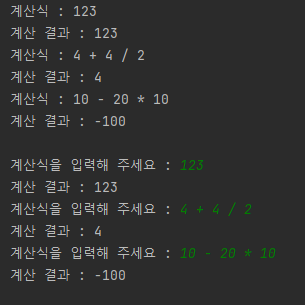

## 문자열 계산기
30분 안에 요구사항을 지키면서 Main 클래스와 동일한 코드를 실행했을 때 같은 출력 결과가 나와야 한다. 

### Main 클래스
```java
import java.io.IOException;

public class Main {
    public static void main(String[] args) {
        new Calculator().calculate("123");
        new Calculator().calculate("4 + 4 / 2");
        new Calculator().calculate("10 - 20 * 10");

        System.out.println();
        try {
            new Calculator().calculate();   //  입력 : "123"
            new Calculator().calculate();   //  입력 : "4 + 4 / 2"
            new Calculator().calculate();   //  입력 : "10 - 20 * 10"
        } catch (IOException e) {
            e.printStackTrace();
        }
    }
}
```
### 출력 결과



### 요구사항
* 문자열 계산기는 사칙연산의 계산 우선순위가 아닌 입력 값에 따라 계산 순서가 결정된다.  
  예를 들어 "4 + 4 / 2"를 입력할 경우 6이 아닌 4를 출력해야 한다.
* 나눗셈은 소수점을 버린다.

### 프로그래밍 요구사항
* 오버로딩을 통해 매개변수가 있는 메서드와 매개변수가 없는 메서드를 하나씩 구현한다.
  * 매개변수가 없는 메서드는 문자열을 입력 받고 계산한다. (Main 클래스 코드 참고)
* 메서드가 15줄이 넘지 않게 구현한다.
* 한 메서드에 한 단계의 들여쓰기만 한다.
  * 예를 들어 for문안에 if문을 넣으면 들여쓰기는 2단계이다. (메서드를 추가해서 들여쓰기를 줄일 수 있다.)

위 문제는 넥스트 스텝의 자바 플레이그라운드 with TDD, 클린코드를 수강 중 나온 문자열 계산기 문제와 객체지향 생활 체조 원칙을  
챕터6에서 나온 내용을 적용할 수 있게 조금 변경한 것 입니다.

[객체지향 생활 체조 원칙]()을 무조건적으로 지키는 것은 좋지 않아 보이지만 참고하면서 코드를 작성하니까  
객체지향적으로 코드를 작성하는데 많은 도움이 되었습니다. 한번 읽어보시면 좋을 것 같아요! 
